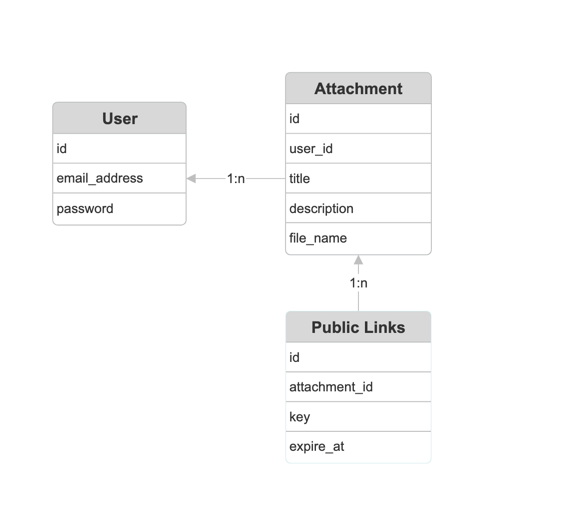

# README

## Setup
1. Install ruby `v3.3.1`
2. Clone this repo
3. `cd` to repo
4. Execute `gem install bundler`
5. Then `bundle install`
6. Note: This version does not have functionality to create user from UI,
   hence create user using rails console.
7. To start rails console, execute `rails c`
8. In the console create users by providing `email_address` and `password`
    ex. `User.create(email_address: 'user1@test.com', password: 'abc@1234')`
9. Once user is created start rails server by executing `rails s`
10. Visit `http://localhost:3000` on browser.

## ER Diagram
ER diagram excluding authentication Models

## Naviagation
1. All attachments
   1. User can login with email and password.
   2. Once logged in user can see all the attachment he has created.

2. Uploading attachment
   1. Click on `New attachment` link from `index` page
   2. Add Title, description (optional) and attachment
   3. Submit the form to create attachment.

3. Downloading attachment
    1. Click on download button on `show` page to download attachment.

4. Delete attachment
    1. Click on `Destroy this attachment` button on `show` page.

5. Public url
   1. Click on `Generate public link` button on show page
   2. This will generate publicly accessible url to download attachment and show it on `show` page.
   3. `show` page will show public url if valid one is already present.
   4. User can re-generate public url, although this will not invalided previous url 
   (as person with previous url should be able to download attachment)